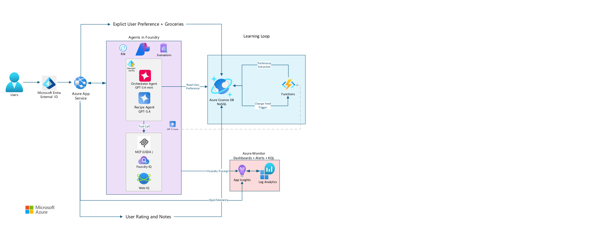

# AI Sous Chef - Detailed Technical Overview

A concise overview of the architecture and three-tab product experience.
Section numbers are preserved for reference. The [architecture decisions](../adr/0001-mvp-contracts.md)
and [API/schema contract](../contracts/api-and-schemas.md) define precise implementation
rules; the [architecture diagram](architecture-diagram.png) shows the service boundaries.

[](architecture-diagram.png)

The PNG is rendered from the supplied single-page PDF. The diagram's
logical "Read User Preference" arrow is mediated by App Service, as specified
in [the ADR's memory boundary](../adr/0001-mvp-contracts.md#agent-memory-and-the-diagrams-read-boundary).

## 1. Summary

AI Sous Chef answers: **What should I cook now, using what I have, within my time,
dietary constraints, nutrition goals, and cooking ability?**

The Azure-based application combines grounded recipe generation, current groceries,
explicit preferences, and feedback-based learning. Explicit preferences always
remain distinct from inferred preferences, which carry confidence and evidence counts.

## 2. Problem

A useful recommendation must reconcile available ingredients, allergies, dietary
restrictions, taste, nutrition goals, skill, time, and missing ingredients. A
generic recipe prompt cannot reliably manage all of these concerns.

The design separates identity, application logic, agent reasoning, grounding,
durable memory, asynchronous learning, safety, evaluation, and observability.

## 3. High-Level Application Flow

1. The user authenticates through Microsoft Entra External ID.
2. App Service authorizes the request and retrieves current user context from Cosmos DB.
3. The Orchestrator coordinates the Recipe + Nutrition Agent through Foundry.
4. Approved tools supply recipe knowledge, nutrition, and relevant external information.
5. Application code validates the final recipe against current safety constraints.
6. The application returns the recipe and persists deliberate cooking/feedback actions.

Feedback learning runs separately from the interactive recipe request; see section 13.

## 4. Web Application - Azure App Service

One Python App Service serves the frontend and API. It owns authentication context,
authorization, onboarding, grocery/preferences CRUD, chat and recipe persistence,
Foundry invocation, and OpenTelemetry instrumentation.

**Product data flows through the backend:** browser -> App Service -> Cosmos DB.
The browser never receives direct database or agent-service credentials.

App Service avoids premature microservices. A different hosting topology would
require a separate decision if components later need independent scaling.

## 5. Authentication - Microsoft Entra External ID

Use the consumer-facing external tenant with App Service authentication, not a
workforce tenant. Entra establishes identity; Cosmos stores cooking context.

Derive a stable user identifier from trusted identity claims. Store only necessary
application profile data, never passwords or authentication secrets. Email is not
the ownership key.

## 6. First-Time User Onboarding

Run onboarding until required setup is complete, and allow later settings edits.

| Category | Information collected |
| --- | --- |
| Dietary constraints | Allergies, restrictions, and foods to avoid |
| Taste | Likes, dislikes, cuisines, flavors, and spice preference |
| Nutrition | Goals such as higher protein, lower sodium, or balanced eating |
| Cooking context | Skill and typical available time |

These are explicit user inputs, not AI inferences. Nutrition goals personalize
meals; they are not medical instructions.

## 7. Azure Cosmos DB for NoSQL - Application Data Model

Keep related, bounded current state together rather than recreating relational
tables for every preference. Store growing histories as separate bounded records.

| Container | Responsibility |
| --- | --- |
| `Users` | Current profile, groceries, explicit preferences, and bounded learned state |
| `RecipeHistory` | Recipe snapshots, cooking state, feedback, and learning provenance |
| `ChatHistory` | Conversation metadata, exchanges, and request state |
| Internal lease storage | Cosmos change-feed coordination for the learning Function |

## 8. Users Container

Maintain one current profile per user.

| Field group | Contents |
| --- | --- |
| Identity/setup | Internal user ID, onboarding completion, creation/update timestamps |
| `groceries` | Stable item identity, ingredient name, optional quantity/unit, update time |
| `explicitPreferences` | Allergies, restrictions, likes/dislikes, cuisines, spice, skill, time, nutrition goals |
| `learnedPreferences` | Insight, confidence, evidence count, source, and update metadata |

Do not embed lifetime chat, recipe history, or an ever-growing evidence list in
this document. Collection and item-size limits belong to the API/schema contract.

## 9. Explicit vs. Learned Preferences

| Explicit | Learned |
| --- | --- |
| Entered directly in structured onboarding/settings | Inferred from validated behavior and feedback |
| For example, peanut allergy or dislike of mushrooms | For example, a recurring preference for citrus-forward flavors |
| Updated through ordinary App Service CRUD | Updated through asynchronous extraction and validation |
| Overrides conflicting inferences | Retains provenance, confidence, and evidence count |

An illustrative learned insight is:

```json
{
  "insight": "prefers citrus-forward sauces",
  "confidence": 0.86,
  "evidenceCount": 4,
  "source": "recipe_feedback"
}
```

This example is not a calibrated probability or a prescribed threshold. Never
silently convert learned state into an explicit user statement.

## 10. Grocery State

Groceries represent current availability and belong in bounded `Users` state.
Adding or editing an item is an App Service/database operation, without an LLM
or Function invocation.

Keep unknown amounts distinct from zero. Receipt ingestion is a possible later
extension: store uploaded files in Blob Storage and extracted inventory in Cosmos,
not the other way around.

## 11. RecipeHistory Container

Save self-contained recipe snapshots separately from the profile. A history
record preserves ingredients, instructions, nutrition, source references, rating,
notes, acceptance/cooking state, timestamps, and feedback-processing state.

Distinguish saving from confirmed cooking; never fabricate a cooked timestamp.
Use authenticated user scope for history queries and retain enough revision
provenance to correct feedback without counting it twice.

## 12. ChatHistory Container

Persist conversation identity, ordered exchanges, message roles/content,
timestamps, and relevant recipe/operation references. Keep records bounded instead of
putting a lifetime conversation into one array.

Stored history and model context are different: retrieve only recent/relevant
context for each request. Casual chat such as "Maybe Mexican tonight" is not
automatically a lasting cuisine preference. Chat retention is separate from
durable profile and recipe-feedback policies.

## 13. Preference Learning Loop

The learning path is:

```text
Rating + notes -> App Service -> RecipeHistory -> Cosmos change feed
              -> Azure Function -> preference extraction -> Users.learnedPreferences
```

The Function considers the note, rating, recipe, explicit preferences, existing
learned state, and relevant prior evidence. It proposes structured, evidence-linked
insights, then validates and merges eligible results.

Versioned processing must tolerate retries and repeated events. Only relevant
behavioral changes start extraction; grocery/profile CRUD and processing-status
updates must not create learning work.

## 14. Microsoft Foundry and the Foundry SDK

Use **Microsoft Foundry (new)** as the managed agent, model, tool, grounding,
evaluation, and tracing platform, never Foundry classic. App Service and the
learning Function use Python `azure-ai-projects` 2.x with `AIProjectClient`,
Entra authentication, and the integrated OpenAI Responses/Conversations client.
Use versioned agents and the new agent object model, not classic Python agent
clients or Assistants/Threads/Runs APIs.

Do not add a second orchestration framework by default. More complex orchestration
would require a reviewed architectural change. The [architecture contract](../adr/0001-mvp-contracts.md#new-foundry-and-sdk-contract)
defines the SDK baseline and implementation checks. The New Foundry SDK and
specified models/tools are assumed to work; no feasibility research or
capability-discovery gate is required, and classic Foundry is not a fallback.

## 15. Agent Architecture

Use two interactive agents: **Orchestrator** and **Recipe + Nutrition**.
Separate responsibilities only where specialization adds value; unnecessary
agents create more calls, latency, handoff failures, and evaluation scenarios.

Asynchronous preference extraction is a separate Function workflow, not a third
interactive cooking agent.

## 16. Orchestrator Agent

The Orchestrator interprets the request, coordinates the specialist and tools,
checks the result against user intent, and requests bounded revision when needed.

Its context includes relevant groceries, explicit constraints, nutrition goals,
time/skill, eligible learned preferences, and recent conversation/history.
Explicit direction takes precedence over inference.

## 17. Recipe + Nutrition Agent

The specialist retrieves grounded recipe candidates and adapts them to groceries,
diet, nutrition goals, skill, and available time. It proposes substitutions,
identifies missing ingredients, obtains grounded nutrition, and returns clear
cooking instructions.

Adapt source patterns rather than copying retrieved recipes verbatim.

## 18. Controlled Creativity

| Must remain grounded | May be creatively adapted |
| --- | --- |
| Allergies, restrictions, and user state | Flavor combinations and presentation |
| Ingredient availability and nutrition facts | Practical substitutions and variations |
| Retrieved recipe evidence and safety rules | Techniques suited to skill/time and fewer missing ingredients |

The objective is a useful recipe for this person, not unrestricted invention or
static search. Every variation still passes deterministic safety validation.

## 19. Data Sources and Grounding

| Source | Purpose |
| --- | --- |
| [Hugging Face recipe dataset](https://huggingface.co/datasets/untitledwebsite123/food-recipes/viewer/default/train?p=5225) | Curated recipe corpus, cleaned and indexed through Foundry IQ |
| [USDA MCP integration](https://github.com/HemantaPatil/mcp_postgres) | Authoritative food/nutrition retrieval |
| Web IQ | Conditional current/external grounding when it adds value |

Treat the dataset as an ingestion source, not a giant prompt. Prioritize explicit
user data and current groceries, then eligible learned context and appropriate
grounding tools. Do not fabricate nutrition from model memory or perform web
retrieval unnecessarily.

## 20. Responsible AI and Food Safety

- Validate final ingredients, substitutions, and ingredient-bearing instructions
  against current allergies and strict restrictions outside the LLM.
- Reject, clarify, or regenerate unsafe or unverifiable candidates before display.
- Support factual claims with retrieved/tool evidence; label nutrition as estimated
  and informational, not medical advice.
- Combine Foundry safety controls with application-specific cooking checks.
- Treat retrieved content, notes, web pages, and tool output as untrusted data.
- Restrict tools and evaluate injection, jailbreak, state-tampering, and cross-user attacks.

## 21. Service-to-Service Security

Use managed identities and least-privilege Azure RBAC by default for Azure-hosted
workloads. Keep developer Entra sign-in distinct from deployed identities, with
no production fallback to developer credentials or service keys.

App Service and the learning Function have separate permissions for their roles:
the web app manages authorized product requests; the Function reads eligible
feedback, invokes extraction, and updates learned state. Never embed credentials
in source code or share one unnecessarily privileged identity.

Each interactive Foundry agent has a distinct Entra Agent ID for permissions and
auditability. Verify which principal each tool actually uses; a logical agent
name is not an identity boundary. Agent identities do not grant direct Cosmos
product-data access. Use workload identity federation for deployment automation;
unavoidable secrets require a reviewed exception, protected storage, and rotation.

## 22. User Authorization and Data Isolation

Authentication is not sufficient: every grocery, profile, chat, recipe, rating,
and note operation must enforce ownership using trusted identity context.

Do not trust a browser-supplied `userId`. Scope reads and writes to the authenticated
user before accessing data, rather than filtering another user's records afterward.

## 23. PII and Privacy

Keep necessary sensitive content in secured product storage: allergies, restrictions,
goals, notes, chat, and preferences. Do not duplicate it into routine telemetry.

Operational telemetry should favor opaque correlation IDs, service/agent/tool names,
result codes, latency, token usage, and dependency/exception classifications.
Do not use email as the correlation key.

Generative-AI traces can contain prompts, responses, instructions, and tool payloads.
Sensitive trace content requires separate controls and more restrictive access
than ordinary performance data.

## 24. Observability

Correlate the HTTP request, Cosmos reads, Foundry execution, specialist/tool calls,
validation, persistence, and response. Give asynchronous learning its own trace
linked to the originating feedback.

Include the actual calling principal, agent identifier/version, model deployment,
provider response ID, and application operation/trace IDs. The nano extraction
workload is attributed to the Function identity. Identity audit logs and execution
traces are complementary; missing attribution must not be invented.

Use Foundry tracing for agent activity, OpenTelemetry for custom application
instrumentation, and Application Insights for requests, dependencies, and exceptions.
Operators should be able to locate the failing step without exposing raw user content.

## 25. Azure Monitor and Log Analytics

Use dashboards, alerts, and KQL to investigate application errors, agent/tool
failures, learning failures, Cosmos throttling, latency, token usage, invalid
structured output, and evaluation regressions.

Monitoring must distinguish feedback successfully saved from preference extraction
failing later.

## 26. Evaluations

Use repeatable Foundry evaluations for groundedness, relevance, safety/constraint
adherence, grocery utilization, feasibility, nutrition grounding, tool selection,
personalization, and creativity within constraints.

Include allergy conflicts, vegetarian/meat conflicts, explicit-versus-learned
disagreement, unavailable tools/nutrition, insufficient groceries, unrealistic
time limits, prompt injection, and conflicting taste/nutrition goals.

Use the agreed MVP models without an alternative-model evaluation prerequisite.
Any future model change needs evaluation evidence, not size alone, and must
preserve required accuracy and safety.

## 27. Why the System Improves Over Time

Cooking, ratings, and notes provide evidence beyond onboarding. Repeated feedback
can strengthen or contradict an inferred preference and affect later recipes.

Personalization improvement is an evaluation question, not a guarantee after a
fixed number of meals. Learned conclusions remain distinguishable from explicit facts.

## 28. Why Azure Functions Are Used Selectively

Keep grocery edits, explicit preference updates, and history reads on the normal
App Service/database path. Use the Function for independent asynchronous work
after meaningful recipe feedback is persisted.

This prevents extraction latency or failure from blocking routine interactions.
A future receipt-processing feature could use a similar event-driven pattern.

## 29. Development and Deployment Setup

Develop collaboratively on feature branches with reviewed PRs into `dev`, then
promote validated releases to `main`. Protect both integration branches and require
review rather than direct commits.

Use environment-specific local/dev/production configuration, without hardcoded
endpoints or credentials. The development environment is a Windows host with WSL;
the architecture contract defines the precise runtime/tooling baseline.

## 30. Key Setup Decisions

| Decision | Rationale |
| --- | --- |
| App Service | One primary Python web/API deployment without premature microservices |
| Cosmos DB for operational state | Queryable, evolving documents with bounded profiles and separate histories |
| Blob Storage only for files | Appropriate for optional uploaded receipts, not core preference/history records |
| New Foundry SDK 2.x | Versioned managed agents, Responses/Conversations, tools, grounding, evaluations, and tracing; no classic integration |
| Managed identities | Avoid embedded long-lived workload credentials |
| Selective Functions | Isolate event-driven learning from ordinary CRUD |

## 31. Success Metrics

| Area | Evidence of success |
| --- | --- |
| Recipe quality | Practical, creative meals fitting groceries, time, skill, and explicit preferences |
| Grounding | Supported recipe/nutrition claims and appropriate conditional web retrieval |
| Personalization | Evidence-linked learned state improves recommendations without overriding explicit constraints |
| Agent behavior | Correct tools and bounded, necessary handoffs |
| Safety | Deterministic restriction enforcement and resilience to hostile content |
| Observability | Correlated model/tool/database/learning activity without unnecessary PII exposure |

## 32. Final Architecture Principle

Keep each service's role narrow: Entra authenticates; App Service owns the browser
boundary; Cosmos stores product state; Foundry runs reasoning and grounding;
Functions consolidate feedback; the monitoring stack makes behavior observable.

**Grounded knowledge + controlled creativity + durable personalization +
deterministic safety** should not require turning every logical responsibility
into a separate deployed service.

## 33. User Experience and UI Architecture

| Tab | User's question |
| --- | --- |
| Groceries | What do I have? |
| Sous Chef | What should I cook? |
| Recipe History | What did I think of what I cooked? |

All tabs share the authenticated user's state and communicate through App Service.
The interface should hide infrastructure complexity, not safety or failure states.

## 34. Tab 1 - Groceries

Provide lightweight inventory maintenance: view, add, delete, increase, and decrease
known quantities, with optional units. Keep it faster and simpler than a full
household inventory-management system.

## 35. Grocery Tab - UI Requirements

| Action | Behavior |
| --- | --- |
| Add | Enter an ingredient and optional known quantity/unit; save through the backend |
| Increase/decrease | Update the selected row safely; do not lose concurrent edits |
| Reach zero | Follow the confirmed-removal policy rather than retain meaningless zero stock |
| Delete | Remove the selected active inventory row |

Display name, quantity state, and clearly labeled controls. Expiration dates,
categories, and automatic normalization are not required MVP fields.

## 36. Grocery Updates Do Not Trigger AI

Grocery maintenance is standard authorized CRUD. It neither invokes an LLM nor
starts preference learning. The next recipe request reads the newly persisted state.

## 37. Grocery Context During Recipe Generation

Use current inventory to prioritize owned ingredients, consider practical substitutions,
and identify missing items. Distinguish **already available**, **need to buy**, and
unknown quantity/availability rather than inventing stock.

Minimize unnecessary purchases without eliminating useful recipe creativity.

## 38. Tab 2 - Sous Chef Chat

Present a focused conversation interface with a conversation list and active chat.
On laptops, show the sidebar beside the chat; on mobile, expose history through
an accessible drawer/menu. Keep the composer and current response easy to reach.

## 39. Chat Sidebar

Offer New Chat, conversation titles, selection, and a clear active-conversation
indicator. Reopening a conversation loads its own paginated history.

Titles should be concise and safe to render. Stored conversation history is not
the same as the bounded context sent to the model.

## 40. Chat Data Model

| Required information | Purpose |
| --- | --- |
| User and conversation IDs | Ownership and conversation isolation |
| Exchange/message identity and order | Stable history, retries, and complete question/answer context |
| Roles, content, timestamps | Reconstruct the user-visible conversation |
| Optional recipe/operation references | Link structured results and processing state |

The API/schema contract defines complete-exchange storage and limits. Do not
expose another user's conversation or append lifetime history to each request.

## 41. New Chat Behavior

New Chat creates a distinct conversation identifier. The backend supplies current
groceries, constraints, goals, cooking context, eligible learned preferences, and
relevant evidence without printing the entire profile into the visible chat.

## 42. Recipe Request Flow

For a request such as "Something spicy with my chicken, within 30 minutes":

1. Authenticate and load current, bounded user context.
2. Invoke the Orchestrator and Recipe + Nutrition Agent.
3. Retrieve recipe grounding, USDA nutrition, and conditional web context.
4. Check request fit and run deterministic final-recipe safety validation.
5. Persist and return a structured result, or an explicit safe failure.

## 43. Recipe Response UI

Show recipe title, time, difficulty, a concise explanation of fit, ingredients,
owned/missing items, ordered instructions, and nutrition with provenance/status.

Useful explanations include "Uses four ingredients you already have" or "Fits
your 30-minute limit." Do not expose hidden chain-of-thought.

Clearly label nutrition estimates as informational, not medical advice.

## 44. Recipe Acceptance and Cooking State

Generation alone does not create cooking evidence. Offer deliberate save and
confirmed-cooked actions, preserving an immutable recipe snapshot.

Saving records intent, not a fabricated cooked date. Confirmed-cooked, unrated
recipes become eligible for the awaiting-feedback view under the lifecycle contract.

## 45. Tab 3 - Recipe History and Ratings

The tab has two primary areas:

- **Needs your rating:** eligible cooked recipes with labeled rating choices,
  a prominent optional note, and Submit.
- **History:** a concise paginated recipe-title/rating list, distinguishing saved
  recipes from confirmed-cooked ones.

Retain complete feedback metadata in storage without cluttering the default view.

## 46. Rating Model

| Label | Stored value |
| --- | --- |
| Liked | `liked` |
| Fine | `fine` |
| Didn't like | `disliked` |

Ratings summarize the meal; notes explain what to repeat or change. For example:
"Loved the lime sauce, but wanted more heat." Specific note meaning drives
individual learned preferences rather than being flattened into the overall rating.

## 47. Feedback Submission Flow

Submit the rating and optional note through App Service to the owned history
record. Persist the feedback revision and learning-processing marker together.

Return once the write succeeds; do not wait for extraction or claim that
personalization has already changed.

## 48. Learning Trigger

The change-feed Function validates eligible recipe-feedback revisions and invokes
preference extraction. It turns user notes and contextual evidence into candidate
insights with source references, then validates and merges eligible learned state.

Users do not need to keep Recipe History open. Replayed or status-only events
must not manufacture new evidence.

## 49. Preventing Bad Preference Learning

Do not promote one observation into an unquestioned lasting fact. Preserve
confidence, distinct evidence counts, provenance, contradictions, and corrections.

Specific notes can differ from the overall rating: a disliked meal may still
include a loved sauce. Count the occasion once per insight, not once for the
rating and again for the note. Apply the reviewed eligibility policy, and never
rewrite explicit preferences or infer/remove an allergy.

## 50. Recipe History Detail View

A detail view may show the saved recipe, ingredients, instructions, nutrition,
cooking date, rating, and notes. Keep the main list concise; a rich detail screen
can be deferred even though recipe details remain available through the API.

## 51. Cross-Tab State

| Change | Expected effect |
| --- | --- |
| Add or edit groceries | The next recipe request uses the new inventory |
| Save or mark a recipe cooked | History reflects the correct lifecycle state |
| Submit feedback | The saved rating/note appears without waiting for learning |
| Complete eligible learning | Future requests can use the updated learned preference |

The product loop is **inventory -> conversation -> cooking -> feedback -> learning**.

## 52. UI Authentication and Authorization Requirements

Require authentication for all three tabs and ownership checks for every backend
operation, including groceries, conversation history, recipe details, ratings,
and notes. Browser-supplied identifiers select resources; they do not prove access.

## 53. UI Privacy Requirements

Do not put emails, allergies, goals, notes, chat, or preference text in URLs or
routine client telemetry. Use opaque route IDs and events such as
`conversation_opened`, `grocery_added`, `recipe_generated`, and `recipe_rated`.

Apply the same privacy boundary to frontend and backend instrumentation.

## 54. Loading and Error States

| Failure | User-visible behavior |
| --- | --- |
| Grocery write | Explain that the update failed; do not display unpersisted state as saved |
| Agent/tool request | Show a safe failure and retry path, without internal payloads or stack traces |
| Feedback write | Say the rating was not saved and preserve the draft |
| Later learning failure | Keep saved feedback usable; track and alert on processing failure separately |

Every tab also needs clear loading and empty states. Never turn a dependency
failure into a success-shaped response.

## 55. Accessibility and Responsive Design

Support mobile phones and laptops with responsive layout, labeled controls,
visible focus, keyboard operation, and touch-friendly targets. Do not rely on
hover, color, or emoji alone.

Keep the tabs reachable, collapse the sidebar on narrow screens, and preserve
unsaved input when layout/orientation changes. The mobile keyboard must not hide
the note/composer or submission controls. The architecture contract specifies
the viewport and browser coverage.

## 56. MVP UI Scope

| Area | Required | Deferred |
| --- | --- | --- |
| Groceries | View/add/delete and quantity controls | Receipt scanning, expiration, categories, automatic normalization |
| Sous Chef | New chat, sidebar/history, personalized recipes, ingredients/instructions, shopping needs, nutrition, save/cook | Images, voice, sharing, comparisons, timers |
| Recipe History | Awaiting-rating view, three ratings, optional notes, title/rating history, asynchronous learning | Advanced filtering/search, favorites, statistics, advanced preference explanations |

## 57. Frontend-to-Backend API Requirements

| Area | Minimum capabilities |
| --- | --- |
| Groceries | Read, add, update quantity, delete |
| Chat | Create/list/reopen conversations; send and persist user/assistant exchanges |
| Recipes | Save/confirm cooked, list awaiting feedback/history, retrieve details, submit ratings/notes |
| User context | Retrieve profile, complete onboarding, update explicit settings and nutrition goals |

Exact routes, validation, revisions, and errors are defined in the API/schema contract.

## 58. UI-to-Data Mapping

| UI | State/services |
| --- | --- |
| Groceries | `Users.groceries` |
| Sous Chef | Current `Users` context, `ChatHistory`, and Foundry agents/tools |
| Recipe History | `RecipeHistory` snapshots, lifecycle, ratings, notes, and processing state |
| Asynchronous learning | `RecipeHistory` change feed -> Function -> `Users.learnedPreferences` |

All browser access goes through App Service; the UI does not manage cloud connections.

## 59. End-to-End User Journey

1. Sign in and complete explicit dietary, taste, nutrition, and cooking settings.
2. Add current groceries.
3. Ask for a meal matching ingredients, time, skill, and constraints.
4. Receive a grounded, safety-validated recipe with missing items and nutrition status.
5. Save it if desired and explicitly confirm cooking.
6. Submit a rating and notes about what worked or should change.
7. Let asynchronous extraction validate evidence and update eligible learned preferences.
8. Use that learned context in future recommendations without overriding explicit direction.

**What I have. What I should cook. What I thought of it.**